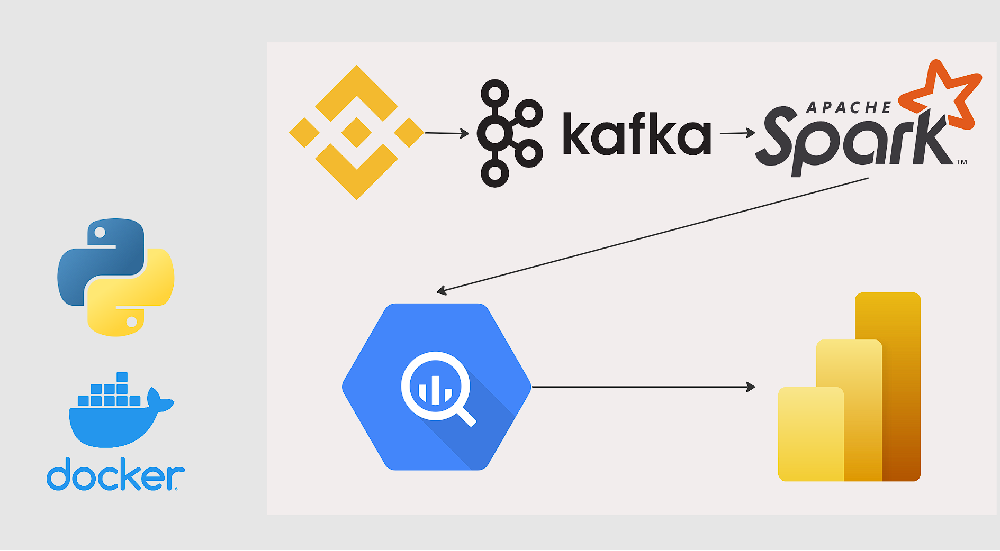
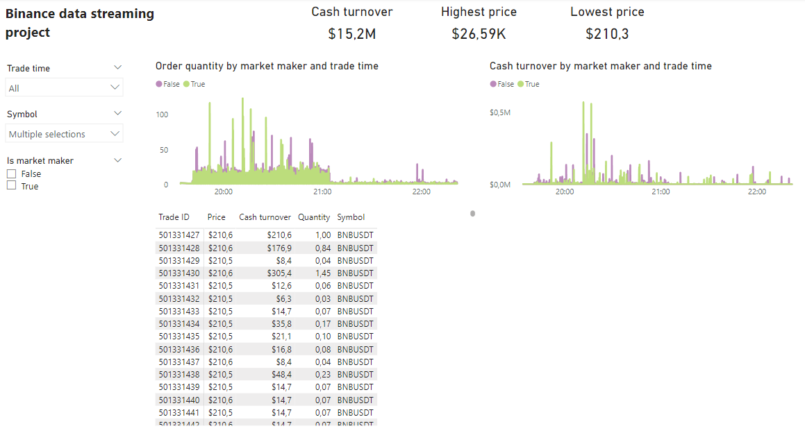

# Binance data streaming

## Description
Hello everyone! 
I wanted to learn Kafka and Spark so I decided to make a project to help myself. The idea of the project is to get Binance data about trades and price of coins, this will help with analytical decision making about selling/buying/holding coins, transform and clean this and load into BigQuery database.

## Tools and technologies 
- Websocket Binance API for getting data
- Kafka for handling streaming data
- PySpark for collecting, cleaning and writing data
- BigQuery as a DataWarehouse
- PowerBI as BI tool

## Architecture

## Dashboard

